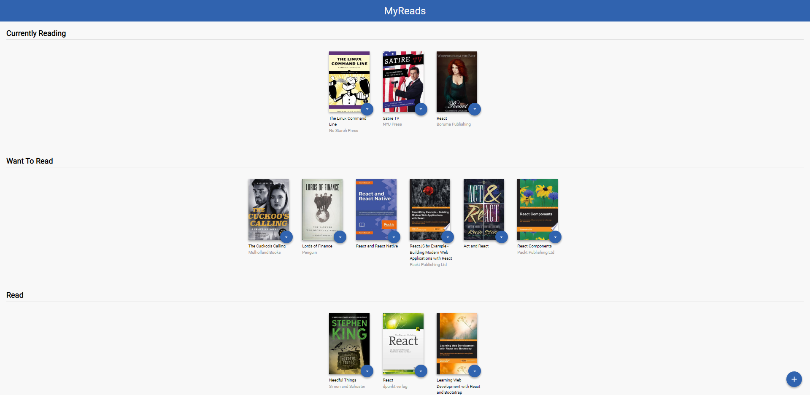
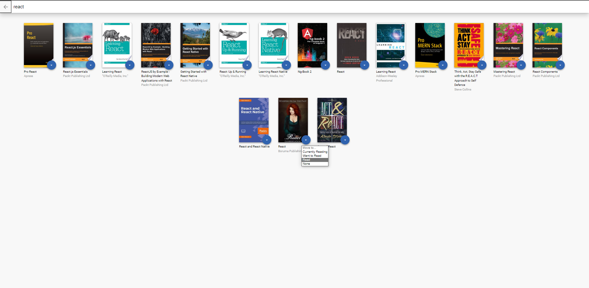

# Getting Started with Create React App

My Reading React-App is a single-page app, it is for storing your books and track what you're reading and what you list to watch later. MyReads lets you manage your digital bookshelf.

This project was bootstrapped with [Create React App](https://github.com/facebook/create-react-app/blob/main/docusaurus/docs/adding-typescript.md).

## How to run the App

The app uses Node.js and the React to start. If you do not have Node installed, you can download it here: Node.js

```
git clone https://github.com/drmez2020/react-mybooks.git
npm install
```

then after git all dependencies you can launch the app with

```
npm start
```

Runs the app in the development mode.\
Open [http://localhost:3000](http://localhost:3000) to view it in the browser but make sure 3000 port is not busy or you will need to start in another port.

## React js With TypeScript integration

Project build with React & TypeScript to get benefits from Types and tracking errors before finish coding

```
npx create-react-app react-mybooks --template typescript
```

## File Structure
```
┣ 📂public
┃ ┣ 📜favicon.ico
┃ ┗ 📜index.html
┣ 📂src
┃ ┣ 📂APIs
┃ ┃ ┗ 📜BooksAPI.tsx
┃ ┣ 📂components
┃ ┃ ┣ 📜Book.tsx
┃ ┃ ┣ 📜BookList.tsx
┃ ┃ ┣ 📜BookShelves.tsx
┃ ┃ ┗ 📜header.tsx
┃ ┣ 📂Hooks
┃ ┃ ┗ 📜useQuery.tsx
┃ ┣ 📂icons
┃ ┃ ┣ 📜add.svg
┃ ┃ ┣ 📜arrow-back.svg
┃ ┃ ┗ 📜arrow-drop-down.svg
┃ ┣ 📂screenshots
┃ ┃ ┣ 📜MyReads-bookshelf.png
┃ ┃ ┣ 📜MyReads-Search.png
┃ ┃ ┗ 📜MyReads-Drop-menu.png
┃ ┣ 📜App.css
┃ ┣ 📜App.test.tsx
┃ ┣ 📜App.tsx
┃ ┣ 📜index.css
┃ ┣ 📜index.tsx
┃ ┣ 📜react-app-env.d.ts
┃ ┣ 📜reportWebVitals.ts
┃ ┗ 📜setupTests.ts
┣ 📂types
┃ ┣ 📜book.type.ts
┃ ┣ 📜headers.type.ts
┃ ┗ 📜SearchingValue.ts
┣ 📜.gitignore
┣ 📜.hintrc
┣ 📜.prettierignore
┣ 📜.prettierrc.json
┣ 📜package-lock.json
┣ 📜package.json
┣ 📜README.md
┗ 📜tsconfig.json
```

In the project directory, you can run:

##Screen snips

### `Book Shelves`



### `Books searching`


### `Book menu`



### Resources:

- [Project starter template](https://github.com/udacity/reactnd-project-myreads-starter)
- [Project Rubric](https://review.udacity.com/#!/rubrics/918/view)
- [TypeScript Handbook](https://www.typescriptlang.org/)
- [TypeScript Example on React](https://www.typescriptlang.org/play/index.html?jsx=2&esModuleInterop=true&e=196#example/typescript-with-react)
- [React + TypeScript Cheatsheets](https://github.com/typescript-cheatsheets/react-typescript-cheatsheet#reacttypescript-cheatsheets) has a good overview on how to use React with TypeScript
